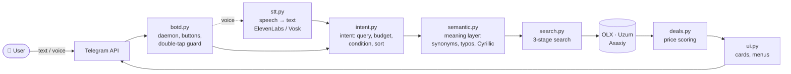
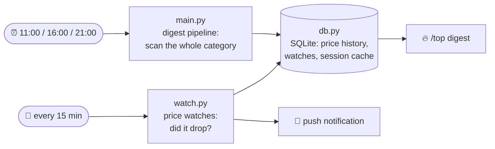

<div align="center">


# Telegram Deal Hunter

**A Telegram bot that finds underpriced listings on Uzbekistan's largest
classifieds site — and tells you whether the price is actually good.**

Semantic search in Uzbek · Russian · English  ·  voice input  ·  market-median price scoring

[](https://www.python.org/)
[](https://t.me/xalyavauz_bot)


**[🇺🇿 O'zbekcha](README.uz.md)** · [Architecture](#architecture) · [Live bot](https://t.me/xalyavauz_bot)

</div>

---

## The problem

Tashkent's second-hand market runs on **OLX**, and it is hostile to buyers:

- Listings are written in a **mix of Uzbek, Russian and transliteration**, full of
  typos — `sovutgich`, `холодильник`, `xolodilnik` and `muzlatgich` are the same
  fridge, but OLX's search matches raw text, so each query returns a different slice.
- A "cheap" phone is often an **installment plan** — the price shown is the down
  payment (`Bosh to'lov: 310$ / 12-oy: 77$`), not the product.
- To know whether 11 mln so'm is a good price for an iPhone 15 Pro, you have to
  open twenty listings and two retail sites yourself.

**This bot does all of that in about a second, from a text or a voice message.**

<table>
<tr><td width="50%" valign="top">

**Search — typed or spoken**

```
You:  iphone 15 pro 12 mln gacha

🔎 iPhone 15 Pro · 5 found · under 12 mln

1️⃣ iPhone 15 Pro 256GB
   💰 11.4 mln · 🔻 18% below market
   🟢 Good price · Chilonzor · 2h ago

2️⃣ iPhone 15 Pro 128GB
   💰 10.2 mln · 🔻 9% below market
   🟡 Normal price · Yunusobod · 5h ago

   [1️⃣] [2️⃣] [3️⃣] [4️⃣] [5️⃣]
```

</td><td width="50%" valign="top">

**Detail card — one tap, zero network calls**

```
iPhone 15 Pro 256GB
💰 11 400 000 so'm · negotiable
🟢 Good price · ~18% below market
💸 You save: ~2.5 mln so'm
   (≈ 16 months of home internet 🌐)
📦 Used · OLX
📍 Chilonzor · 2 hours ago

[🔗 Open listing]  [❤️ Watch price]
[🔁 Similar]       [··· More]
```

</td></tr>
</table>

---

## Engineering highlights

The parts that were genuinely hard, and what they cost to solve:

| Problem | Solution | Result |
|---|---|---|
| **Search misses half the market.** Users type Uzbek; listings are written in Russian. Online translation added 0.3–1.3 s per query and still failed on slang. | An **offline semantic layer** (`semantic.py`): 147 concepts across Uzbek/Russian/English + slang, brand aliases, spelling correction, Cyrillic→Latin, a concept hierarchy (`iphone ⊂ phone`) and conflict rules (`kolonka` the speaker ≠ `gas kolonka` the water heater). | Every query is expanded into the right language variants **with zero network calls**; live search quality **98%** on a 34-case benchmark. |
| **Fake bargains.** Installment listings show the down payment as the price, so a 3.7 mln "iPhone 16 Pro" looked like a 61% discount. | Pattern detection for payment schedules, deposits and advances, plus **negation-aware** filters — `"singan emas"` (*not broken*) must not read as broken. | Installment and defect listings are excluded from both deal scoring and the peer median that other listings are judged against. |
| **Anti-bot protection.** OLX (CloudFront) and Uzum (SmartCaptcha) drop plain HTTP clients. | `curl_cffi` with Chrome TLS fingerprint impersonation, against OLX's public JSON API rather than HTML scraping. | Stable scraping without a headless browser. |
| **Buttons felt slow.** Every tap re-ran a search and re-hit the network. | Results are **pre-rendered into a session cache** at search time (`cb_ctx`, 20-min TTL); a callback only reads from SQLite. A test enforces *zero* outbound calls in callback paths. | Search **p50 ≈ 950 ms**, button tap **p50 ≈ 0.1 ms**. |
| **Double taps produced double answers.** Telegram delivers every tap, and a second `answerCallbackQuery` is silently dropped — so the second reply vanished while the second *action* still ran. | A single-dispatch handler (`finally: ack()`) plus a claim registry (`claim_action`): heavy actions get a 3 s sliding window, editing actions 0.8 s. | One tap → one answer. 100 taps, or 8 parallel taps, still produce exactly one search and one reply — enforced by tests. |
| **Uzbek speech has no off-the-shelf STT.** Spoken numbers (`bir yarim million`), ordinals (`o'n beshinchi ayfon`) and spelled-out brands (`el ji` = LG) all broke the query. | A transcript-repair layer on top of Vosk/ElevenLabs: a full Uzbek numeral parser, ordinal reordering, acronym assembly, and semantic spell-correction. | Voice and text share one pipeline; `o'n beshinchi ayfon pro maks` → `iPhone 15 Pro Max`. |
| **A "50% off" label destroys trust if it is wrong.** | Price is compared against the **median of similar live listings** first, own price history second, retail price last — never retail alone. Honesty clamps forbid contradictory labels. | A listing above the market median can never be labelled "good price"; the 🔴 *suspicious* flag catches the rest. |

---

## Architecture

No web framework, no ORM, no runtime ML service — plain Python 3, SQLite and
`curl_cffi`. Two independent flows share one database.

### 1. Interactive flow — user asks, bot answers



### 2. Background flow — bot watches on its own



### Module map

| Module | Responsibility |
|---|---|
| `run.py` | Single entry point: daemon + digest schedule + watch loop |
| `botd.py` | Telegram daemon: commands, inline keyboards, callbacks, group rules |
| `main.py` | Daily digest pipeline (CLI: `--dry-run`, `--get-chat-id`) |
| `xalyava/semantic.py` | **Meaning layer**: 147 concepts (UZ/RU/EN), brand aliases, spell correction, hierarchy, conflicts |
| `xalyava/intent.py` | Natural query → structured `SearchIntent` (budget, condition, sort) |
| `xalyava/search.py` | Search engine: query variants, 3 stages, relevance filtering |
| `xalyava/deals.py` | Price scoring, baseline selection, fake-discount detection, dedupe |
| `xalyava/analyze.py` | Installment/credit, replica, defect and wholesale filters (negation-aware) |
| `xalyava/match.py` | Tokenisation, product matching, product keys |
| `xalyava/sources.py` | OLX / Uzum / Asaxiy clients (`curl_cffi`, browser impersonation) |
| `xalyava/watch.py` | Price watches, quiet hours, three-layer anti-spam |
| `xalyava/stt.py` | Speech→text and transcript repair (numerals, acronyms) |
| `xalyava/ui.py` | Cards, menus, title cleaning, every user-facing string |
| `xalyava/db.py` | SQLite: price history, watches, preferences, analytics |
| `xalyava/tg.py` | Telegram API wrapper — never raises |
| `xalyava/settings.py` | Env-based config, secret redaction |

<details>
<summary><b>Design decisions worth knowing</b></summary>

**Normalisation lives in five layers, not one.** Token level
(`match.tokens`), query level (`search`), comparison level (`_relevant`),
product key (`deals.product_key`) and display (`ui.clean_title`) each need
different rules — merging them caused real bugs (a query for *telefon* went
dead because the display layer treated it as noise). Full write-up in
[ARCHITECTURE.md](ARCHITECTURE.md) (in Uzbek).

**Callbacks never touch the network.** Everything a button can show is
rendered at search time and stored in a session row. A static test asserts no
outbound call exists in any callback path.

**Groups get no reply keyboard.** A persistent keyboard occupies every group
member's screen — a real complaint from users. Groups get inline buttons and
Telegram's native `/` menu only.

**The database never stores message text.** Analytics keep event type and
counts; names are stored as SHA-256 hashes; voice files are deleted right
after transcription.

</details>

---

## How the price rating comes out

Every result carries one of four labels: 🔥 *great deal* · 🟢 *good price* ·
🟡 *normal* · 🔴 *suspicious*.

The baseline is the **median of similar live listings**, not the retail price —
comparing a used phone to a new one manufactures a fake "50% discount".
Baseline priority:

1. **Other listings of the same product** (peer median) — most reliable
2. **Our own price history** (`price_snapshots`) — accumulated over time
3. **Uzum / Asaxiy retail price** — weakest signal

Guard rails:

- **Installment listings are removed entirely** — their price is a down payment.
- **The label must match the number.** A listing above the market median can
  never be called "good price"; a gap under 12% can never be "great deal".
- **🔴 suspicious** triggers at 50%+ below peer median (for an identical model
  and storage size that almost always means damage or fraud), on
  defect/replica/credit markers, or on complaints from three distinct users.

---

## Quality & testing

```bash
./venv/bin/python bench/test_units.py      #   58  unit tests
./venv/bin/python bench/test_ux.py         #  140  Telegram UX tests
./venv/bin/python bench/test_qa.py         #  721  QA scenarios
./venv/bin/python bench/test_quality.py    #  184  quality regressions
./venv/bin/python bench/test_audit.py      #  102  audit regressions
./venv/bin/python bench/test_semantic.py   #  171  semantic / voice / settings
./venv/bin/python bench/test_search.py     #   34  live search cases (network)
```

**1376 offline tests**, no network, seconds to run. Live search quality is held
at **≥97%** (currently 98%).

Every test guards a defect that actually happened — negation handling
(*"not broken"* must not read as broken), product names surviving title
cleaning, one answer per button tap, no dead-end screens, no user text in logs.
Several rounds were found by adversarial multi-agent audits, and
`test_audit.py` exists to keep those fixes from regressing.

---

## Security & privacy

| Concern | Handling |
|---|---|
| **Secrets** | Environment / `.env` only. Storing a token in `config.json` is forbidden and a test enforces it. `.env` is never committed |
| **Logs** | `settings.redact()` strips tokens; `Settings.__repr__` prints "present/absent" instead of values |
| **Message text** | **Never stored.** Analytics keep event type and counts only |
| **Names / usernames** | SHA-256 hashes |
| **Voice files** | Deleted immediately after transcription |
| **User rights** | `/sozlamalar` → 🗑 "delete my data" wipes everything |

Voice can run fully offline with `STT_MODEL=vosk:vosk-model-small-uz-0.22` —
nothing leaves the machine. Policy and key-rotation guide: [SECURITY.md](SECURITY.md).

---

## Running it

```bash
git clone https://github.com/VohidovTohirjon/telegram-deal-hunter.git
cd telegram-deal-hunter
cp .env.example .env        # add your TELEGRAM_TOKEN
docker compose up -d
```

One container runs everything: command daemon, digest schedule and watch loop.

<details>
<summary><b>Local (macOS / Linux) and launchd service</b></summary>

```bash
python3 -m venv venv && ./venv/bin/pip install -r requirements-dev.txt
cp .env.example .env
./venv/bin/python run.py    # daemon + schedule + watches in one process
```

As a permanent macOS service — replace the `__PROJECT_DIR__` placeholder:

```bash
for f in uz.xalyava.bot uz.xalyava.botd; do
  sed "s|__PROJECT_DIR__|$PWD|g" $f.plist > ~/Library/LaunchAgents/$f.plist
  launchctl bootstrap gui/$(id -u) ~/Library/LaunchAgents/$f.plist
done
```

> Don't run `run.py` and the launchd digest at the same time — the digest would
> be sent twice.
>
> `last exit code = 78: EX_CONFIG` means launchd can't open the log file
> (macOS `com.apple.macl` attribute); that's why the plists redirect to `/tmp`
> and Python rotates its own logs into `logs/`.

</details>

All configuration goes through `.env` — see [`.env.example`](.env.example).

---

## Project at a glance

| | |
|---|---|
| **Stack** | Python 3.11+ · SQLite · `curl_cffi` · Vosk / ElevenLabs STT · Telegram Bot API · Docker |
| **Size** | ~8 500 lines of application code across 15 modules, ~4 300 lines of tests |
| **Performance** | Search p50 ≈ 950 ms · button tap p50 ≈ 0.1 ms |
| **Interface** | Uzbek (bot UI), understands Uzbek / Russian / English input |
| **Status** | Running in production for a private Telegram group since Aug 2026 |

### Documentation

| File | Contents |
|---|---|
| [README.uz.md](README.uz.md) | Full Uzbek version of this page |
| [ARCHITECTURE.md](ARCHITECTURE.md) | Deep dive (Uzbek): every file, the five normalisation layers, where STT plugs in, honest "where is the ML?" answer, and the traps behind each design choice |
| [SECURITY.md](SECURITY.md) | Secret policy, key rotation, third-party data flows |

---

<div align="center">
<sub>Built for Tashkent, in Uzbek. 🇺🇿 &nbsp;·&nbsp; <a href="https://t.me/xalyavauz_bot">@xalyavauz_bot</a></sub>
</div>
