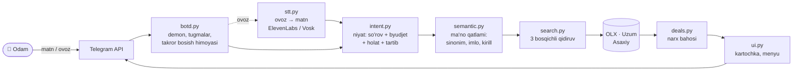
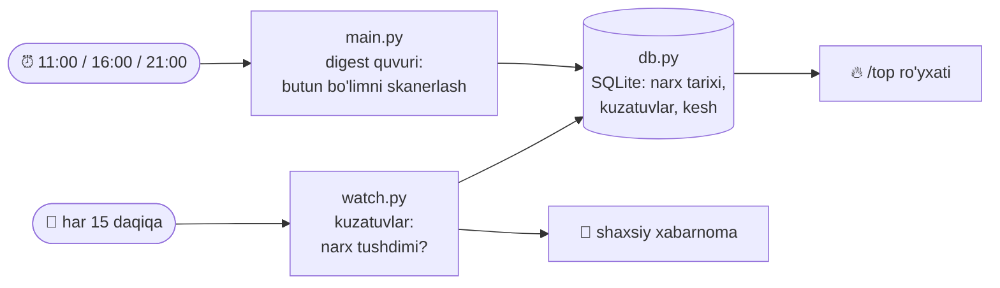

<div align="center">


# Xalyava

**Toshkent bo'yicha shaxsiy xarid yordamchisi — Telegram bot.**
OLX e'lonlarini Uzum, Asaxiy va bozordagi o'xshash e'lonlar bilan solishtirib,
har bir topilmaga bir qarashda tushunarli baho beradi.

[](https://www.python.org/)
[](https://t.me/xalyavauz_bot)


[](LICENSE)

**[🇬🇧 English version](README.md)**

</div>

---

## Bir jumlada

Odam **oddiy tilda yozadi yoki gapiradi** — bot ma'noni tushunadi, e'lonlarni
topadi, narxini bozor bilan solishtiradi va **«bu arzonmi yoki yo'q»** degan
savolga javob beradi. Hammasi bir necha soniyada, o'zbek tilida.

> [!TIP]
> **Loyihani birinchi marta ochyapsizmi?** Quyidagi [Arxitektura](#arxitektura)
> bo'limi umumiy manzarani beradi, [ARCHITECTURE.md](ARCHITECTURE.md) esa
> har bir fayl va qatlamni chuqur tushuntiradi.

---

## Ko'rinishi

<table>
<tr><td width="50%" valign="top">

**Qidiruv — matn yoki ovoz**

```
Siz:  iphone 15 pro 12 mln gacha

🔎 iPhone 15 Pro · 5 ta topildi
   12 mln gacha

1️⃣ iPhone 15 Pro 256GB
   💰 11.4 mln · 🔻 18% arzon
   🟢 Yaxshi narx · Chilonzor · 2 soat oldin

2️⃣ iPhone 15 Pro 128GB
   💰 10.2 mln · 🔻 9% arzon
   🟡 Oddiy narx · Yunusobod · 5 soat oldin

   [1️⃣] [2️⃣] [3️⃣] [4️⃣] [5️⃣]
```

</td><td width="50%" valign="top">

**Kartochka — raqam bosilganda**

```
iPhone 15 Pro 256GB
💰 11 400 000 so'm · kelishiladi
🟢 Yaxshi narx · bozordan ~18% past
💸 Tejaysiz: ~2.5 mln so'm
   (≈ 16 ta oylik internet 🌐)
📦 B/u · OLX
📍 Chilonzor · 2 soat oldin

[🔗 E'lonni ochish] [❤️ Kuzatish]
[🔁 Shunga o'xshash] [··· Boshqa]
```

</td></tr>
</table>

---

## Nimalarni uddalaydi

|  | Imkoniyat |
|---|---|
| 🧠 | **Ma'noni tushunadi.** «sovutgich» = «muzlatgich» = «xolodilnik» = «холодильник» = «fridge». Imlo xatolari («samsung ultura», «asuz», «noutbook lenova»), kirill yozuvi va jargon — hammasi bitta tushunchaga keladi. Butunlay oflayn, `xalyava/semantic.py` |
| 🎙 | **Ovozni tushunadi.** «o'n beshinchi ayfon pro maks» → iPhone 15 Pro Max, «el ji» → LG, «bir yarim million» → 1 500 000. Shaxsiy chatda avtomatik, guruhda ovozga javob qilib `/ovoz` |
| 💰 | **Narxni baholaydi.** 🔥 Ajoyib deal · 🟢 Yaxshi narx · 🟡 Oddiy narx · 🔴 Shubhali. Etalon — bozordagi o'xshash e'lonlar medianasi, yangi mahsulot narxi emas |
| 🕵️ | **Tuzoqlarni ajratadi.** Bo'lib to'lash/kredit e'lonlari («Bosh to'lov: 310$»), kopiya, nosoz, zapchast, ulgurji — arzon deal deb ko'rsatilmaydi |
| ❤️ | **Kuzatadi.** «15 mln dan past bo'lsa ayt», «20% arzonlashsa ayt», «yana sotuvga chiqsa ayt» — fon rejimida tekshiriladi, spamga uch qavatli himoya |
| 🔥 | **Kunlik top.** 11:00 / 16:00 / 21:00 da butun bo'lim skanerlanadi, eng yaxshi topilmalar `/top` da to'planadi |
| 🧠 | **Narxni o'rganadi.** Bozorda solishtirishga e'lon topilmasa (e'lonlarning 77%), narxni **o'z ma'lumotimizda o'rgatilgan model** baholaydi — xatosi 21% (eski usulda 42%), va har bashorat tushuntiriladi |
| ⚙️ | **Sozlanadi.** Tinch vaqt, holat (yangi/b/u), tartib (arzon/deal/yangi), qiziqishlar, ma'lumotlarni o'chirish |
| 🎈 | **Yoqimli.** Reaksiyalar (👀 → 🔥/👍/🤔), tejash hisobi, «salom»/«rahmat» ga suhbat javobi |

---

## Buyruqlar

Nomlar **o'zbekcha** — foydalanuvchi tarjimasiz tushunadi. Inglizcha nomlar
alias sifatida ishlayveradi (`botd.CMD_ALIAS`), Telegram'ning «/» menyusida ham
ko'rinadi (`setMyCommands`).

| Buyruq | Nima qiladi |
|---|---|
| `/qidir <so'rov>` | Mahsulot qidirish — so'rovsiz yozsangiz, so'rab oladi |
| `/ovoz` | Guruhda: ovozli xabarga **javob** qilib qidirish |
| `/top` | Bugungi eng yaxshi topilmalar |
| `/kuzatuv` | Narxini kuzatayotganlarim |
| `/sozlamalar` | Bildirishnoma, holat, tartib, qiziqishlar (shaxsiy chat) |
| `/menyu` · `/yashir` | Tugmalar panelini ochish · yashirish |
| `/yordam` · `/haqida` · `/maxfiylik` | Qo'llanma · bot haqida · maxfiylik |
| `/fikr` | Taklif yoki shikoyat — keyingi xabaringiz adminga boradi |
| `/bekor` | Boshlangan amalni bekor qilish |
| `/stats` · `/fikrlar` · `/javob` | Admin buyruqlari (faqat shaxsiy chatda) |

---

## Ishga tushirish

### Docker — VPS uchun tavsiya etiladi

```bash
git clone https://github.com/VohidovTohirjon/telegram-deal-hunter.git
cd telegram-deal-hunter
cp .env.example .env        # TELEGRAM_TOKEN ni to'ldiring
docker compose up -d
docker compose logs -f
```

Bitta konteyner hammasini bajaradi: buyruq demoni, digest jadvali va kuzatuv
sikli. `cron` yoki `launchd` kerak emas; ma'lumot `xalyava-data` volume'ida.

### Lokal (macOS / Linux)

```bash
python3 -m venv venv && ./venv/bin/pip install -r requirements-dev.txt
cp .env.example .env        # sirlarni yozing
./venv/bin/python run.py    # hammasi bitta jarayonda
```

<details>
<summary><b>launchd bilan doimiy xizmat (macOS)</b></summary>

Plist'lardagi `__PROJECT_DIR__` o'rin egallovchisini o'z yo'lingizga almashtiring:

```bash
for f in uz.xalyava.bot uz.xalyava.botd; do
  sed "s|__PROJECT_DIR__|$PWD|g" $f.plist > ~/Library/LaunchAgents/$f.plist
  launchctl bootstrap gui/$(id -u) ~/Library/LaunchAgents/$f.plist
done
```

Holatni tekshirish:

```bash
launchctl print gui/$(id -u)/uz.xalyava.botd | grep -E "state =|last exit"
```

> `run.py` va launchd digestini birga ishlatmang — digest ikki marta ketadi.
>
> `last exit code = 78: EX_CONFIG` chiqsa, launchd log faylini ocholmayapti
> (macOS `com.apple.macl` atributi). Shuning uchun plist'lar `/tmp` ga
> yo'naltirilgan; haqiqiy loglarni Python o'zi `logs/` ga aylantirib yozadi.

</details>

Barcha sozlamalar `.env` orqali beriladi — namuna va izohlar:
[`.env.example`](.env.example).

---

## Arxitektura

Loyihada **web framework yo'q, ORM yo'q, ish paytida ML xizmati yo'q** — sof
Python, SQLite va `curl_cffi`. Ikkita mustaqil oqim bir bazani baham ko'radi.

### 1. Interaktiv oqim — odam so'raydi, bot javob beradi



### 2. Fon oqimi — bot o'zi qaraydi



### Fayl xaritasi

| Modul | Vazifasi |
|---|---|
| `run.py` | Yagona kirish nuqtasi: demon + digest jadvali + kuzatuv sikli |
| `botd.py` | Telegram demoni: buyruqlar, tugmalar, callback'lar, guruh qoidalari |
| `main.py` | Digest quvuri (CLI: `--dry-run`, `--get-chat-id`) |
| `xalyava/semantic.py` | **Ma'no qatlami**: 147 tushuncha (uz/ru/en), brend aliaslari, imlo tuzatish, kirill, ziddiyatlar |
| `xalyava/intent.py` | Tabiiy so'rov → tuzilgan `SearchIntent` (byudjet, holat, tartib) |
| `xalyava/search.py` | Qidiruv dvigateli: variantlar, 3 bosqich, relevantlik filtri |
| `xalyava/deals.py` | Narx bahosi, etalon tanlash, soxta chegirma detektori, dedupe |
| `xalyava/analyze.py` | Kredit/bo'lib to'lash, kopiya, nosoz, ulgurji filtrlari (inkorni tushunadi) |
| `xalyava/match.py` | Tokenizatsiya, mahsulot moslashtirish, mahsulot kaliti |
| `xalyava/sources.py` | OLX, Uzum, Asaxiy mijozlari (`curl_cffi`, brauzer taqlidi) |
| `xalyava/price_model.py` | **Narx modeli** — o'z e'lonlarimizda o'rgatiladigan ridge regressiya; bozorda o'xshash e'lon bo'lmaganda etalon bo'ladi, har bashorat tushuntiriladi |
| `xalyava/ml.py` | **Embedding qatlami** — lokal ONNX transformer (MiniLM int8); «Shunga o'xshash» va lug'at qazish uchun, asosiy reytingda ATAYLAB emas |
| `xalyava/watch.py` | Kuzatuvlar, tinch vaqt, spamga qarshi uch qavat |
| `xalyava/stt.py` | Ovoz → matn va transkriptni tuzatish (sonlar, akronimlar) |
| `xalyava/ui.py` | Kartochkalar, menyular, sarlavha tozalash, barcha matnlar |
| `xalyava/db.py` | SQLite: narx tarixi, kuzatuvlar, sozlamalar, analitika |
| `xalyava/tg.py` | Telegram API — hech qachon istisno tashlamaydi |
| `xalyava/settings.py` | Env asosidagi konfiguratsiya, sirlarni yashirish |

<details>
<summary><b>Muhim qarorlar — nega shunday qilingan</b></summary>

**Normalizatsiya bitta joyda emas, beshta qatlamda.** Har qatlamning o'z
vazifasi bor: token (`match.tokens`), so'rov (`search`), solishtirish
(`_relevant`), mahsulot kaliti (`deals.product_key`), ko'rsatish
(`ui.clean_title`). Batafsil: [ARCHITECTURE.md §5](ARCHITECTURE.md).

**Semantik qatlam oflayn.** Tarjima xizmatiga bog'lanish sekin va ishonchsiz
edi. Endi lug'at kod ichida: so'rov bir zumda ruscha variantga ham aylanadi
(OLX e'lonlari asosan ruscha), imlo tuzatiladi, kirill lotinga o'giriladi.

**Tugma bosilganda tarmoqqa chiqilmaydi.** Natijalar sessiyaga oldindan
tayyorlangan holda yoziladi (`cb_ctx`, 20 daqiqa) — kartochka darhol ochiladi.

**Bir tugma — bir javob.** Har callback aynan bitta `answerCallbackQuery`
oladi; 100 marta bosilsa ham faqat birinchisi bajariladi
(`botd.claim_action`). Ikkalasini ham testlar qo'riqlaydi.

**Guruhda reply-klaviatura yo'q.** U guruhning har bir a'zosi ekranini
egallaydi. Guruhda faqat inline tugmalar va Telegram'ning «/» menyusi.

</details>

---

## AI / ML qayerda ishlatilgan

Uchta ML qatlami bor va **har biri o'lchov bilan** qo'shilgan: avval
"qoidalar bilan qanday?" deb solishtirilgan, model faqat **yutgan joyda**
qoldirilgan.

| Qatlam | Nima | Turi |
|---|---|---|
| **Ovoz → matn** | ElevenLabs Scribe yoki Vosk/Kaldi (lokal) | neyron akustik model |
| **Narx modeli** | ridge regressiya, **o'z ma'lumotimizda o'rgatiladi** | o'rgatilgan model |
| **Embedding** | MiniLM (ONNX int8), lokal ishlaydi | 12 qatlamli transformer |
| So'rovni tushunish, filtrlar, relevantlik | 147 tushunchali lug'at, regex, token qoidalari | **qoida** |

### 1. O'z ma'lumotimizda o'rgatilgan narx modeli

Eng ishonchli etalon — bozordagi o'xshash e'lonlar medianasi. Lekin real
bazada e'lonlarning **77% uchun** 2 tadan kam o'xshash e'lon bor. Ilgari bot
o'sha holatda "solishtirish uchun ma'lumot yetarli emas" derdi.

Endi u bozorni **o'rganadi**: `log(narx) ≈ w·x` — brend, model raqami,
xotira hajmi va holat belgilari bo'yicha. Real bazada 5-fold CV (MdAPE):

| Usul | Hammasi | Kam peer (77%) |
|---|---|---|
| global mediana | 62% | — |
| mahsulot medianasi (eski yo'l) | 42% | 66% |
| **ridge model** | **21%** | **26%** |

Ko'rilmagan mahsulotlarda ham (train'da o'sha mahsulot yo'q) model **22%**,
mediana **62%** — ya'ni u mahsulotni yodlamaydi, brend/model/xotira narxga
qanday ta'sir qilishini o'rganadi.

**Nega ridge, neyron tarmoq emas:** ma'lumot kichik (~1200 e'lon), bashorat
baho hisobiga sezilarli vaqt qo'shmasligi kerak (hozir 0.008 ms) va eng muhimi — **har bashorat tushuntirilishi shart**:
`iPhone 15 Pro Max 256GB` uchun `15 +117%`, `pro +78%`, `iphone +50%`,
`256GB +9%`. Tushuntirib bo'lmaydigan bahoga foydalanuvchi ishonmaydi.

Model har bir necha soatda o'zini qayta o'rgatadi. Bo'lib to'lash, nosoz va
kopiya e'lonlari o'quv to'plamiga **kiritilmaydi**, ustiga ikki bosqichli
robust moslash — aks holda boshlang'ich to'lov narxlari butun shkalani pastga
tortib ketardi.

### 2. Embedding — bir joyda ishlatilgan, boshqasida ataylab rad etilgan

Ko'p tilli transformer **lokal** ishlaydi (21 sarlavha ~27 ms) va
**«Shunga o'xshash»** tugmasini quvvatlaydi: natijalar avval qoidalar bilan
filtrlanadi, keyin embedding ular ichida ma'no yaqinligi bo'yicha tartiblaydi.

Asosiy qidiruv reytingida **ataylab ishlatilmaydi** — bu ham o'lchangan:
qoidalar 96–98%, xom embedding **75%**. E'lon sarlavhalari qisqa va shovqinli,
o'zbekcha esa model uchun kam resursli til: muzlatgich so'roviga
«Микроволновка Samsung» «Холодильник Samsung»dan yuqori chiqardi. So'rovni
ruschaga o'girib berish battar qildi (38%). Bu yerda lug'at yutadi — demak
lug'at qoladi.

### 3. Model o'zi «ishonchim past» desa

Akustik model har so'zga ishonch bahosini beradi. U chegaradan past bo'lsa bot
taxmin qilmaydi, so'raydi: *«Shunday tushundim: «…» — shuni qidiraymi?»* —
tasdiqlash, qayta aytish yoki yozib yuborish tugmalari bilan. Modelning ichki
signali noto'g'ri javob emas, bitta savolga aylanadi.

### 4. Model — qoidalarni yozishga yordamchi

`bench/mine_concepts.py` embedding yordamida real sarlavhalardan lug'at
bilmaydigan so'zlarni qazib oladi va dasturchiga **taklif** qiladi — «airwrap»
(48 marta uchragan, lug'atda yo'q) shunday topildi. Qarorni odam qabul qiladi,
ishlash paytidagi mantiq deterministik qolaveradi.

> Har bir qatlam ixtiyoriy: model faylini o'chirsangiz yoki
> `PRICE_MODEL_ENABLED=0` / `EMBED_ENABLED=0` qo'ysangiz, bot eski qoidaviy
> yo'ldan ishlayveradi — buni testlar majburlaydi.

---

## Narx bahosi qanday chiqadi

Asosiy etalon — **bozordagi o'xshash e'lonlar medianasi**, yangi mahsulot narxi
emas. Sabab: ishlatilgan telefonni yangisining narxi bilan solishtirish soxta
«50% chegirma» beradi. Etalon tanlash tartibi:

1. **Shu mahsulotning boshqa e'lonlari** (peer median) — eng ishonchli
2. **Bizning narx tarixi** (`price_snapshots`) — vaqt ichida to'planadi
3. **O'rgatilgan narx modeli** — bozorda solishtirishga hech narsa bo'lmasa
4. **Uzum/Asaxiy yangi narxi** — eng zaif signal

Qoidalar:

- **Bo'lib to'lash e'lonlari butunlay chiqarib tashlanadi.** «Bosh to'lov:
  310$ / 12-oy: 77$ dan» kabi e'londa ko'rsatilgan narx mahsulotniki emas —
  uni «61% arzonlashdi» deb ko'rsatish yolg'on bo'ladi.
- **Yorliq narxga mos bo'lishi shart.** Bozor medianasidan qimmat e'lon hech
  qachon «🟢 Yaxshi narx» deb atalmaydi; 12% dan kam farq «🔥 Ajoyib» bo'lolmaydi.
- **🔴 Shubhali** belgilari: bozordan 50%+ arzon (bir xil model va xotira uchun
  bunday farq deyarli har doim nosozlik yoki firibgarlik), nosozlik/kopiya/kredit
  izlari, yoki kamida uch foydalanuvchining shikoyati.

---

## Testlar

```bash
./venv/bin/python bench/test_units.py      #   58 birlik testi
./venv/bin/python bench/test_ux.py         #  140 Telegram UX testi
./venv/bin/python bench/test_qa.py         #  721 QA senariysi
./venv/bin/python bench/test_quality.py    #  184 sifat testi
./venv/bin/python bench/test_audit.py      #  102 audit regressiyasi
./venv/bin/python bench/test_semantic.py   #  171 semantik/ovoz/sozlama testi
./venv/bin/python bench/test_ml.py         #   83 ML testi: model, embedding, ovoz
./venv/bin/python bench/test_search.py     #   34 real qidiruv holati (tarmoq)
```

**1459 ta oflayn test** — tarmoqsiz, soniyalarda ishlaydi. Har o'zgarishdan
keyin yettitasini ham ishlating. Jonli qidiruv sifati alohida o'lchanadi
(hozir 96% — ML qatlamlari o'chirilganda ham xuddi shu, ular reyting uchun
emas, qamrov uchun qo'shilgan).

<details>
<summary><b>Har to'plam nimani qo'riqlaydi</b></summary>

- **`test_qa.py`** — barcha buyruqlar (shaxsiy + guruh), tanishuv, qidiruv oqimi
  va xato holatlari, tezlik chegarasi, guruh jimligi, ovoz (avtomatik/reply/
  xato), 56 callback (to'g'ri, buzuq, eskirgan), **bitta-ack** va **takror
  bosish himoyasi**, sozlamalar, «o'lik modul chaqiruvi yo'q» statik tekshiruvi.
- **`test_quality.py`** — auditda topilgan REAL nuqsonlar qo'riqchisi: inkorni
  tushunish («singan emas» nosoz emas), sarlavhadan mahsulot nomi yo'qolmasligi,
  narx tarixi takrorlanmasligi, maxfiylik (logda foydalanuvchi matni yo'q),
  interfeys butunligi (o'lik tugma va boshi berk ekran yo'q).
- **`test_semantic.py`** — normalizatsiya (imlo, kirill, brend), tushunchalar
  ierarxiyasi va ziddiyatlari, sinonim orqali relevantlik («sovutgich» ↔
  «Холодильник», «telek» ⊄ «telekom»), ovoz akronimlari, tinch vaqt.
- **`test_audit.py`** — ko'p agentli auditda tasdiqlangan nuqsonlar regressiyasi.
- **`test_search.py`** — jonli OLX so'rovlari bilan sifat o'lchovi (34 holat).

</details>

---

## Xavfsizlik va maxfiylik

| Nima | Qanday |
|---|---|
| **Sirlar** | Faqat `.env` / environment'da. `config.json` da sir saqlash **taqiqlangan** — buni test tekshiradi. `.env` git'ga hech qachon tushmaydi |
| **Loglar** | `settings.redact()` token va kalitlarni matndan olib tashlaydi; `Settings.__repr__` sir o'rniga «bor/yo'q» chiqaradi |
| **Xabar matni** | **Saqlanmaydi.** Analitikaga faqat hodisa turi va sanoq yoziladi |
| **Ism / username** | SHA-256 xesh ko'rinishida |
| **Ovozli xabar** | Matnga o'girilgach fayl **darhol o'chiriladi** |
| **Foydalanuvchi huquqi** | `/sozlamalar` → 🗑 «Ma'lumotlarimni o'chirish» — hammasi o'chadi |

Ovoz butunlay lokal bo'lishi uchun: `.env` da
`STT_MODEL=vosk:vosk-model-small-uz-0.22` — hech narsa tashqariga chiqmaydi.

To'liq siyosat va kalit almashtirish yo'riqnomasi: [SECURITY.md](SECURITY.md).

---

## Brending

| Nima | Qayerda |
|---|---|
| Logotip (SVG manba + PNG) | [`brand/`](brand/) |
| Bot nomi, tavsif, «Start» ekrani matni | `xalyava/ui.py` → `BOT_NAME`, `BOT_SHORT`, `BOT_DESCRIPTION` |

Matnlar demon ishga tushganda avtomatik yuboriladi (`setMyName`,
`setMyShortDescription`, `setMyDescription`) va faqat **o'zgarganda** —
Telegram bu chaqiruvlarni cheklaydi.

> **Avatar qo'lda qo'yiladi.** Bot API'da bot rasmini o'rnatish metodi yo'q:
> @BotFather → `/setuserpic` → `brand/logo.png`.

---

## Hujjatlar

| Fayl | Nima uchun |
|---|---|
| [ARCHITECTURE.md](ARCHITECTURE.md) | Chuqur qo'llanma: har fayl, normalizatsiya qatlamlari, STT ulanishi, «ML qayerda?», tuzoqlar |
| [SECURITY.md](SECURITY.md) | Sirlar siyosati, kalit almashtirish, tashqi xizmatlar |
| [`.env.example`](.env.example) | Barcha sozlamalar izohlari bilan |
| [LICENSE](LICENSE) | MIT — muallif ko'rsatilgan holda erkin ishlatish mumkin |

---

<div align="center">
<sub>Toshkent uchun, o'zbek tilida qurilgan. 🇺🇿</sub>
</div>
